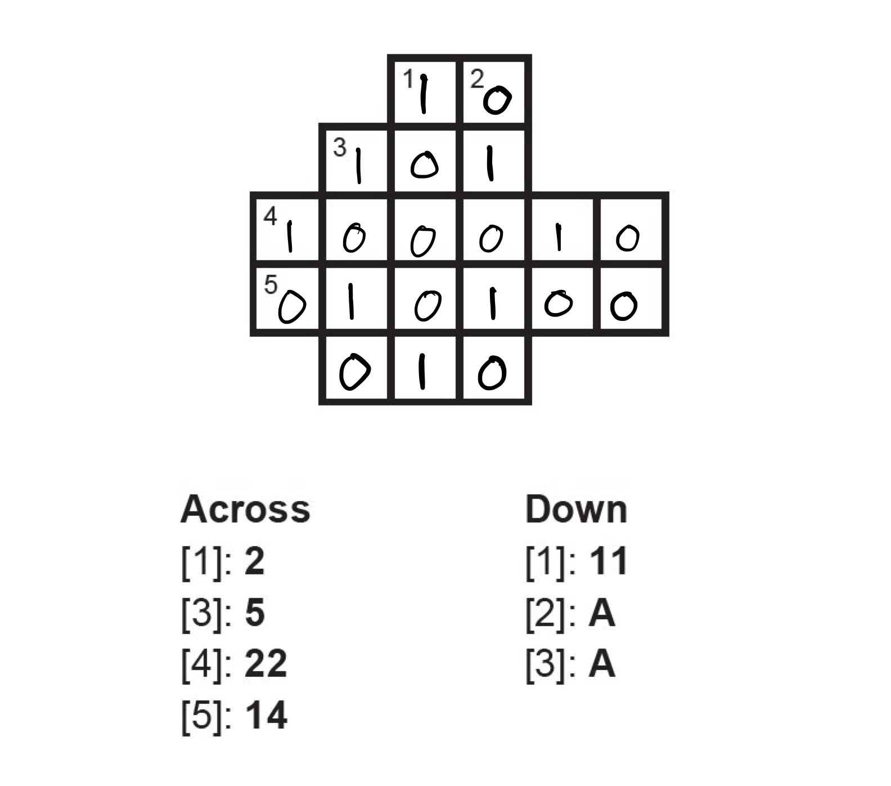

---
tags:
    - Number Systems
    - Number Theory
    - Binary
    - Decimal
    - Hexadecimal
    - Octal
    - Number Conversion
    - Integer Arithmetic
    - Base-2
    - Base-10
    - Base-16
    - Positional Notation
    - Binary Addition
    - Binary Multiplication
---

<h1 align="center">Number Systems</h1>

In this session, we delve into number systems and their fundamental importance in software development. We begin by exploring the world of numbers, from basic number theory to the various number systems that form the foundation of modern computing. We focus particularly on binary, decimal, and hexadecimal notation, which are essential in programming and computer architecture.

The session includes a thorough review of number conversion between different systems, binary addition and multiplication, as well as positional notation. Special emphasis is placed on binary operations and hexadecimal notation, as these play a crucial role in software development, data representation, and digital electronics.

### Session Preparation:

Brooks: [Chapter 2](https://docs.google.com/viewer?url=https://raw.githubusercontent.com/RBrooksDK/MSE_book_v2/master/main.pdf).

### Resources Danish Class
[Lecture notes](https://drive.google.com/file/d/1Ld5qGjQet-Ie8ka6PYilFxHkpzpa-ndP/view?usp=sharing)

[Session materials](https://viaucdk-my.sharepoint.com/:f:/g/personal/rib_viauc_dk/EqAdL2IjxBJIuhBYvL12T8QBaS3fV4FBRbkdF18Koob8sQ?e=HyRXPM)

### Exercises

#### Exercise 1: Binary to Decimal

Convert the following binary numbers into decimal numbers.

1. $110$ (1)
{ .annotate }

    1. $6_{10}$

2. $1110111100_2$(1)
{ .annotate }

    1. $956_{10}$

3. $1001101110110_2$(1)
{ .annotate }

    1. $4982_{10}$

#### Exercise 2: Decimal to Binary
State the binary expansion of the following values and then state the number in binary. 

1. $49_{10}$

    ??? answer "&nbsp;"
        $1\cdot2^5 + 1\cdot2^4 + 0\cdot2^3 + 0\cdot 2^2 + 0\cdot 2^1 + 1\cdot2^0$

        $110001$

2. $212_{10}$

    ??? answer "&nbsp;"
        $1\cdot 2^7 + 1\cdot 2^6 + 1 \cdot 2^4 + 1 \cdot 2^2$

        $11010100_2$

#### Exercise 3: Convert to Decimal
State the hexadecimal expansion of the following values and then state the number in decimal. 

1. $37D_{16}$

    ??? answer "&nbsp;"

        $3 \cdot 16^2 + 7 \cdot 16^1 + 13 \cdot 16^0$

        $893_{10}$

2. $1A9_{16}$

    ??? answer "&nbsp;"

        $1 \cdot 16^2 + 10 \cdot 16^1 + 9 \cdot 16^0$

        $425$

#### Exercise 4: Hex and Binary

Solve the “crossbins” below. The clues are in hexadecimal, and the answers should be in binary.  
**Note**: If your number is too short, add zeros in front!

??? answer "&nbsp;"
    

??? answer "&nbsp;"
    

#### Exercise 5: Hex and Binary

Let $S$ be the set of all binary numbers with 7 characters, and let $f$ be a function from $S$ to $\mathbb{Z}$ given by $f(x_2) = x_{10}$.

1. Determine $f(111010)$.(1)
{ .annotate }

    1. 58

2. The order of a set is the number of elements in a set. For instance the order of ${1, 5, 7, 19, 27, 39}$ is 6. Determine the order of the set $S$. (1)
{ .annotate }

    1. 128

#### Exercise 6: Binary Addition

Perform the following binary addition operations. Show your work by carrying over as necessary.

1. $1011_2 + 1101_2$ (1)
{ .annotate }

    1. $11000_2$ (which equals $24_{10}$)

2. $10110101_2 + 1101110_2$ (1)
{ .annotate }

    1. $100100011_2$ (which equals $291_{10}$)

#### Exercise 7: Binary Multiplication

Perform the following binary multiplication operations. Show your work using the standard multiplication algorithm.

1. $101_2 \times 11_2$ (1)
{ .annotate }

    1. $1111_2$ (which equals $15_{10}$)

2. $1101_2 \times 110_2$ (1)
{ .annotate }

    1. $1001110_2$ (which equals $78_{10}$)

3. $10111_2 \times 1011_2$ (1)
{ .annotate }

    1. $11111101_2$ (which equals $253_{10}$)

