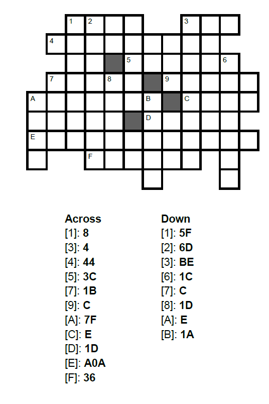

---
tags:
    - Number Systems
    - Number Theory
    - Binary
    - Decimal
    - Hexadecimal
    - Octal
    - Number Conversion
    - Integer Arithmetic
    - Base-2
    - Base-10
    - Base-16
    - Positional Notation
    - Binary Addition
    - Binary Multiplication
---

<h1 align="center">Number Systems</h1>

In this session, we delve into number systems and their fundamental importance in software development. We begin by exploring the world of numbers, from basic number theory to the various number systems that form the foundation of modern computing. We focus particularly on binary, decimal, and hexadecimal notation, which are essential in programming and computer architecture.

The session includes a thorough review of number conversion between different systems, binary addition and multiplication, as well as positional notation. Special emphasis is placed on binary operations and hexadecimal notation, as these play a crucial role in software development, data representation, and digital electronics.

### Session Preparation:

Brooks: [Chapter 2](https://docs.google.com/viewer?url=https://raw.githubusercontent.com/RBrooksDK/MSE_book_v2/master/main.pdf).

### Resources Danish Class
[Lecture notes](https://drive.google.com/file/d/1Ld5qGjQet-Ie8ka6PYilFxHkpzpa-ndP/view?usp=sharing)

[Session materials](https://viaucdk-my.sharepoint.com/:f:/g/personal/rib_viauc_dk/EqAdL2IjxBJIuhBYvL12T8QBaS3fV4FBRbkdF18Koob8sQ?e=HyRXPM)

### Exercises

#### Exercise 1: Binary to Decimal

Convert the following binary numbers into decimal numbers.

1. $110$ (1)
{ .annotate }

    1. $6_{10}$

2. $1110111100_2$(1)
{ .annotate }

    1. $956_{10}$

3. $1001101110110_2$(1)
{ .annotate }

    1. $4982_{10}$

#### Exercise 2: Decimal to Binary
State the binary expansion of the following values and then state the number in binary. 

1. $49_{10}$

    ??? answer "&nbsp;"
        $1\cdot2^5 + 1\cdot2^4 + 0\cdot2^3 + 0\cdot 2^2 + 0\cdot 2^1 + 1\cdot2^0$

        $110001$

2. $212_{10}$

    ??? answer "&nbsp;"
        $1\cdot 2^7 + 1\cdot 2^6 + 1 \cdot 2^4 + 1 \cdot 2^2$

        $11010100_2$

#### Exercise 3: Convert to Decimal
State the hexadecimal expansion of the following values and then state the number in decimal. 

1. $37D_{16}$

    ??? answer "&nbsp;"

        $3 \cdot 16^2 + 7 \cdot 16^1 + 13 \cdot 16^0$

        $893_{10}$

2. $1A9_{16}$

    ??? answer "&nbsp;"

        $1 \cdot 16^2 + 10 \cdot 16^1 + 9 \cdot 16^0$

        $425$

#### Exercise 4: Hex and Binary

Solve the “crossbins” below. The clues are in hexadecimal, and the answers should be in binary.  
**Note**: If your number is too short, add zeros in front!

??? answer "&nbsp;"
    

??? answer "&nbsp;"
    

#### Exercise 5: Hex and Binary

Let $S$ be the set of all binary numbers with 7 characters, and let $f$ be a function from $S$ to $\mathbb{Z}$ given by $f(x_2) = x_{10}$.

1. Determine $f(111010)$.(1)
{ .annotate }

    1. 58

2. The order of a set is the number of elements in a set. For instance the order of ${1, 5, 7, 19, 27, 39}$ is 6. Determine the order of the set $S$. (1)
{ .annotate }

    1. 128

#### Exercise 6: Binary Addition

Perform the following binary addition operations. Show your work by carrying over as necessary.

1. $1011_2 + 1101_2$ (1)
{ .annotate }

    1. $11000_2$ (which equals $24_{10}$)

2. $10110101_2 + 1101110_2$ (1)
{ .annotate }

    1. $100100011_2$ (which equals $291_{10}$)

#### Exercise 7: Binary Multiplication

Perform the following binary multiplication operations. Show your work using the standard multiplication algorithm.

1. $101_2 \times 11_2$ (1)
{ .annotate }

    1. $1111_2$ (which equals $15_{10}$)

2. $1101_2 \times 110_2$ (1)
{ .annotate }

    1. $1001110_2$ (which equals $78_{10}$)

3. $10111_2 \times 1011_2$ (1)
{ .annotate }

    1. $11111101_2$ (which equals $253_{10}$)

#### Exercise 8: Octal

In each subproblem, perform the first conversion and denote the result as x. Then, convert x further into the requested numeral system.

1. $(1101011)_2 \longrightarrow x_8 \longrightarrow x_{10}$

    ??? answer "&nbsp;"

        $(153)_8$ = $107_{10}$

2. $(782)_{10} \longrightarrow x_8 \longrightarrow x_2$

    ??? answer "&nbsp;"
    
        $(1416)_8$ = $1100001110_2$

3. $\left(5 B_7\right)_{16} \rightarrow x_2 \rightarrow x_8$

    ??? answer "&nbsp;"

        $(10110110111)_2$ = $(2667)_8$

### Challenge Exercises

#### Challenge Exercise 1: Binary fractions

1. In a binary number the digits to the left of the decimal point represent $(1,2,4,8, \ldots)-\left(2^0, 2^1, 2^2, 2^3, \ldots\right)$. What do you think the digits to the right of the decimal point represent? Calculate the values corresponding to the first 4 digits.

    ??? answer "&nbsp;"

        $\frac{1}{2}-0.5 ; \quad \frac{1}{4}-0.25 ; \quad \frac{1}{8}-0.125 ; \quad \frac{1}{16}-0.0625$

2. Convert 0.75 to binary.

    ??? answer "&nbsp;"

        $0.11_2$

3. Convert 14.6875 to binary.

    ??? answer "&nbsp;"

        $1110.1011_2$

#### Challenge Exercise 2: Base32

In some contexts, it is an advantage to use even more than 16 symbols to represent numbers - for example, this allows generating shorter web-addresses. One choice is base32, for which the most popular encoding $(R F C 4648)$ is as shown in the table below (note that the symbols "0" and "1" are not used. This is due to their similarity to the letters "O" and "I"):

| 0 | A | 8 | I | 16 | Q | 24 | Y |
| :--- | :--- | ---: | :--- | :--- | :--- | :--- | :--- |
| 1 | B | 9 | J | 17 | R | 25 | Z |
| 2 | C | 10 | K | 18 | S | 26 | 2 |
| 3 | D | 11 | L | 19 | T | 27 | 3 |
| 4 | E | 12 | M | 20 | U | 28 | 4 |
| 5 | F | 13 | N | 21 | V | 29 | 5 |
| 6 | G | 14 | O | 22 | W | 30 | 6 |
| 7 | H | 15 | P | 23 | X | 31 | 7 |

1. Convert the number $L 5 T_{32}$ to decimal.

    ??? answer "&nbsp;"

        $12211$

2. Convert the number 93678 to base32.

    ??? answer "&nbsp;"

        $C3PO_{32}$

3. Converting between binary and hexadecimal is easy, because each digit in hexadecimal corresponds to exactly four digits in binary. Is there  similar symmetry between binary and base32?

    ??? answer "&nbsp;"

        Each digit in base32 corresponds to five digits in binary.

4. Convert $1001011011_2$ to base32.

    ??? answer "&nbsp;"

        $S3_{32}$

5. Convert $BATMAN_{32}$ to binary.

    ??? answer "&nbsp;"

        $0000100000010011011000000001101_2$

#### Challenge Exercise 3: Shannon's Entropy

In information theory, Shannon's entropy is a measure of the uncertainty in a set of possible outcomes. It is defined as:

$$H(X) = -\sum_{i=1}^{n} p(x_i) \log_2 p(x_i)$$

where $H(X)$ is the entropy of the random variable $X$, $p(x_i)$ is the probability of outcome $x_i$, and the sum is taken over all possible outcomes. Notice that because of the base 2 in the logarithm, the answer will be in bits, however, you can also calculate it in other units. 

You can also think of it as a measure of the average amount of information produced by a stochastic source of data.

Note: When talking about several tosses or other events in a row, it is always assumed these events are independent unless stated otherwise.

1. Calculate the entropy of a fair coin toss. (2 equally likely outcomes, 50% chance of heads, 50% chance of tails)

    ??? answer "&nbsp;"
    
        1 bit

2. Calculate the entropy of a biased 70:30 coin toss with a precision of 4 decimal places. (2 outcomes, 70% chance of heads, 30% chance of tails)

    ??? answer "&nbsp;"

        0.8813 bits

3. Calculate the entropy of rolling a fair six-sided die. (6 equally likely outcomes, each with a 1/6 chance)

    ??? answer "&nbsp;"

        2.5850 bits

4. Calculate the total entropy of 100 biased 1:99 coin tosses. (1% chance of heads, 99% chance of tails)

    ??? answer "&nbsp;"

        app. 8 bits (8.0793)

#### Challenge Exercise 4: Entropy application

Common easy-to-implement strategies for storing a series of event results include storing one number representing the outcome of the event for each event, or storing a list of bits representing the possible outcomes with only the final outcome bit set to 1. As you know by now, these strategies may not be the most efficient ways of storing information, most importantly when the outcomes of the events are not equally as likely. In this exercise, try to think of creative solutions for optimizing such problems. 

1. If you had 128 coin tosses and all of them would result in heads, except exactly one that would result in tails, what is the least amount of space in bits in which you could store the outcome of all throws? (order matters)

    ??? answer "&nbsp;"

        7 bits

2. What is some strategy that uses as little space possible when storing the outcomes? Aim for achieving the theoretical minimum, or at least as little as you can.

    ??? answer "&nbsp;"

        For example storing only the position of the tails as a 7 bit number (1-128). This way, we can reconstruct all 128 toss results by for example going from 1 to 128 and checking if the position matches the stored number. If yes, we can output tails, otherwise heads. 

3. Repeat the same for only 100 coin tosses, what is the least amount of space in bits in which you could store the outcome of all throws? (order matters)

    ??? answer "&nbsp;"

        6.6439 bits

4. Most digital systems in real life use binary numbers to store information. For each digit, there are 2 possible states. Can the information of the 100 tosses mentioned earlier be stored with perfect efficiency in binary? (Hint: think about the number of outcomes your storage can represent and what it means to be efficient in these terms)

    ??? answer "&nbsp;"

        No. We can only use a natural number of bits and either we are able to represent more or less than 100 outcomes. (64 / 128, nothing in between). Being efficient in this case means to be able to represent exactly 100 outcomes without any wasted space.

5. What number system could you use instead to store the information more efficiently? (Hint: try to change the base of the logarithm when calculating the entropy, look for whole number final results)

    ??? answer "&nbsp;"

        Base 10 and base 100 both achieve the same perfect efficiency in this case. Both can represent 100 outcomes with a whole number of digits (no remainder means no wasted space). Note that mixed bases could also be used to achieve this efficiency and for finding all possible bases you just need to find all divisors of 100. (except unary wouldn't really be suitable for this)

#### Challenge Exercise 5: Entropy Advanced

In the last exercise, it was guaranteed to get exactly one tails in the series of coin tosses. Now, we will drop that guarantee and instead calculate the entropy of a series of 100 coin tosses with a biased coin (99% chance of heads, 1% chance of tails).

1. Calculate the entropy of a series of 100 biased coin tosses.

    ??? answer "&nbsp;"

        app. 8 bits (8.0793)

2. Imagine we would continue tossing the coin forever. Can you use a similar strategy to store these outcomes compared to the previous exercise? Would it have the same efficiency?

    ??? answer "&nbsp;"

        Yes, as long as you account for the fact that we must continually add to this storage. An example strategy would be to store the numbers in 9 bit blocks that represent how many heads have been tossed between the tails. If the number is too large, we just fill the block with 1s and finish it up in the next block of 9 bits. 

        The efficiency would approach being the same, remember the entropy is about averages, and over time we would approach the theoretical minimum or potential of our strategy but we can't guarantee that the next couple of tosses won't just be tails, hindering our storage-saving strategies. 

3. Try to make a couple of these unfair tosses in a random number generator and try to use your strategy. Would you be saving space compared to fx. storing each toss as one bit? (if not, try to continue, and see if it improves)

