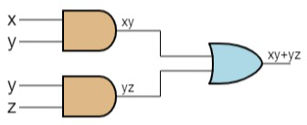
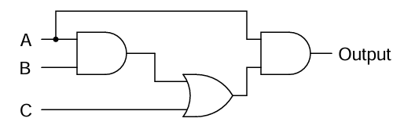
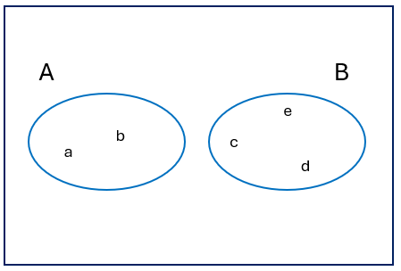

---
tags:
    - Combinatorics
    - Probability
    - Multiplication Rule
    - Permutations
    - Combinations
    - With Replacement
    - Without Replacement
    - Sample Spaces
    - Probability of Events
    - Complements
    - Union
    - Conditional Probability
    - Poker Hands
    - Passwords
---

<h1 align="center">Combinatorics and Probability Theory</h1>

This session explores the principles of counting and the foundations of probability theory.  
We work with the multiplication rule, permutations and combinations, and classical probability of events.  
We also introduce conditional probability and non-trivial applications that illustrate the depth of these concepts.

### Session Preparation:

Brooks: [Chapter 5](https://docs.google.com/viewer?url=https://raw.githubusercontent.com/RBrooksDK/MSE_book_v2/master/main.pdf)

### Resources Danish Class:

[Session notes]()

[Session Resources]()

### Exercises for Recitation

#### Exercise 1: Boolean Algebra Recap

Consider the Boolean function $F(x, y, z)=x y+y(z+x)$.  

1. State the truth table for this function. If the table is constructed correctly, the last column will contain $F$ and will have 8 rows. Reading the rows from the bottom up will give you a binary value. Convert this value to decimal and state this as your result. 

    ??? answer "&nbsp;"
        200

2. Reduce the expression from (1) as much as possible and create the corresponding logic gate.  

    ??? answer "&nbsp;"
        

3. Use Boolean algebra to simplify the following logic gate circuit and state the result as a boolean algebra expression.  

      

    ??? answer "&nbsp;"
        $AB+AC$

#### Exercise 2: Combinatorics and Probability

1. An order for a personal digital assistant can specify any one of five memory sizes, any one of three types of displays, any one of four sizes of a hard disk, and can either include or not include a pen tablet. How many different systems can be ordered? State which Rule/Theorem from the book that you use.  

    ??? answer "&nbsp;"
        $5 \cdot 3 \cdot 4 \cdot 2=120$ (Multiplication Rule)

2. A wireless garage door opener has a code determined by the up or down setting of 12 switches.  

    1. How many possible codes are there?  

        ??? answer "&nbsp;"
            $2^{12} = 4096$  

    2. What is the probability that a burglar guesses the right code in the first try?  

        ??? answer "&nbsp;"
            $\frac{1}{4096} = 0.000244 = 0.0244\%$

#### Exercise 3: Combinatorics and Probability

A group of 3 kids is to be formed in a class of 15 kids.  

1. In how many different ways can you make the group if the order of the kids doesn't matter?  

    ??? answer "&nbsp;"
        $\binom{15}{3} = 455$

2. In how many different ways can you make the group if the order of the kids does matter?  

    ??? answer "&nbsp;"
        $P(15,3)=\frac{15!}{12!}=2730$

3. What is the probability that the group will consist of the three kids Xavier, Ygritte and Zelda?  

    ??? answer "&nbsp;"
        $\frac{1}{455}=\frac{6}{2730}=0.00220 = 0.220\%$

#### Exercise 4: Poker Hands

In how many ways can you deal a poker hand of five cards from a standard deck of 52 cards? Also, how many ways are there to select 47 cards from a standard deck of 52 cards?  

??? answer "&nbsp;"
    $\binom{52}{5}=2,598,960$  
    $\binom{52}{47}=2,598,960$

#### Exercise 5: Garage Doors and Burglars Revisited

Recall the garage doors from Exercise 2. What is the probability that a burglar guesses the right code in 3 tries, assuming that the guesses happen with replacement?  

??? answer "&nbsp;"
    $1-\left(\frac{4095}{4096}\right)^3 \approx 0.00073$

#### Exercise 6: Webpage Passwords

A webpage requires the user to create a password that contains exactly 4 characters.  

- $A$: only letters (52 choices per position).  
- $B$: only digits (10 choices per position).  
- $C$: letters or digits (62 choices per position).  

1. If only $A$ is allowed:  

    ??? answer "&nbsp;"
        $\frac{1}{52^4}= \frac{1}{7,311,616}$  

2. If only $B$ is allowed:  

    ??? answer "&nbsp;"
        $\frac{1}{10^4}= \frac{1}{10,000}$  

3. If only $A \cup B$ is allowed:  

    ??? answer "&nbsp;"
        $\frac{1}{52^4+10^4}= \frac{1}{7,321,616}$  

4. If $C$ is allowed:  

    ??? answer "&nbsp;"
        $\frac{1}{62^4}= \frac{1}{14,776,336}$

#### Exercise 7: Probability

The possible five outcomes of a random experiment are equally likely. The sample space is $\{a,b,c,d,e\}$. Let $A=\{a,b\}$ and $B=\{c,d,e\}$.  

1. Draw a Venn diagram showing the sample space and each of the events $A$ and $B$.  

    ??? answer "&nbsp;"
        

2. Determine each of the following probabilities:  

$P(A)$, $P(B)$, $P(\overline{A})$, $P(A \cup B)$, $P(A \cap B)$  

    ??? answer "&nbsp;"
        $P(A)=\frac{2}{5}$  
        $P(B)=\frac{3}{5}$  
        $P(\overline{A})=\frac{3}{5}$  
        $P(A \cup B)=1$  
        $P(A \cap B)=0$

### Challenge Exercises

#### Challenge Exercise 1: Coupon Collector Problem

You repeatedly draw a card uniformly at random from a standard 52-card deck, with replacement.  

1. What is the expected number of draws until you have seen all 52 distinct cards at least once?  

    ??? answer "&nbsp;"
        The expected value is $52 \cdot H_{52}$, where $H_{n}$ is the $n$-th harmonic number.  
        $H_{52} \approx \ln(52)+\gamma+ \tfrac{1}{2\cdot 52} \approx 4.518$.  
        Result: $\approx 52 \cdot 4.518 = 235$ draws.

#### Challenge Exercise 2: Generalized Birthday Problem

How many people are needed in a room so that the probability of **at least three** sharing the same birthday exceeds $0.5$ (assume 365 equally likely birthdays, ignore leap years)?  

    ??? answer "&nbsp;"

        Using Poisson approximation: expected number of triples $\approx \frac{n^3}{6\cdot 365^2}$.  
        Solve $\frac{n^3}{6\cdot 365^2} \approx \ln 2 \approx 0.693$.  
        $n \approx (0.693 \cdot 6 \cdot 365^2)^{1/3} \approx 88$.  
        So around **88 people** are required.

#### Challenge Exercise 3: Conditional Probability with Urns

An urn contains 5 red balls and 7 blue balls. You draw two balls without replacement.  

1. What is the probability the two balls are of the same color?
    ??? answer "&nbsp;"

        $P(\text{same})=\frac{\binom{5}{2}+\binom{7}{2}}{\binom{12}{2}}=\frac{10+21}{66}=\frac{31}{66}\approx 0.47$  

2. Suppose you draw one ball (not revealing its color), then return it, then draw again. What is the probability both are the same color?  

    ??? answer "&nbsp;"
        
        With replacement: $P(\text{same})=\left(\tfrac{5}{12}\right)^2+\left(\tfrac{7}{12}\right)^2=\tfrac{25+49}{144}=\tfrac{74}{144}=\tfrac{37}{72}\approx 0.51$  

3. Explain the difference between the two scenarios.  

    ??? answer "&nbsp;"

        Without replacement introduces dependence (fewer balls left), lowering the chance of a match. With replacement, draws are independent, giving a slightly higher probability.
