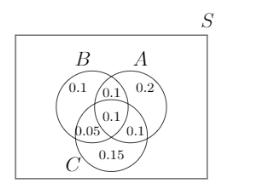

---
tags:
    - Probability
    - Conditional Probability
    - Bayes Theorem
    - Dependent Events
    - Independent Events
    - Contingency Tables
    - Intersection of Events
    - Stochastic Processes
---

<h1 align="center">Conditional Probability and Bayes' Theorem</h1>

This session extends the introductory probability framework to dependent events and conditional reasoning.  
We analyse how the occurrence of one event affects another, use contingency tables for joint distributions, and apply Bayes' theorem to update beliefs with new evidence.

### Session Preparation

Brooks: [Chapter 6](https://docs.google.com/viewer?url=https://raw.githubusercontent.com/RBrooksDK/MSE_book_v2/master/main.pdf)

### Resources Danish Class:

[Session notes](MISSING LINK)

[Session Resources](MISSING LINK)

### Some Python Solutions

[Some Python Solutions](https://github.com/RBrooksDK/MSE1/blob/main/06_Conditional_Probability_and_Bayes_Theorem/some_solutions.ipynb)

### Exercises

#### Exercise 1: Basic Probabilities

Let $A$ and $B$ be two events such that:

$$
P(A)=0.3, \quad P(B)=0.2, \quad P(A \cap B)=0.1
$$

Find the probabilities below. State your answers as correct to one decimal place.

1. \(P(A^c)\) (1) 
{ .annotate }

    1. \(0.7\)

2. \(P(A\cup B)\) (1) 
{ .annotate }

    1. \(0.4\)

3. \(P(A^c \cap B)\) (1)
{ .annotate }

    1. \(0.1\)

4. \(P(A \cap B^c)\) (1)
{ .annotate }

    1. \(0.2\)

5. \(P((A\cup B)^c)\) (1)
{ .annotate }

    1. \(0.6\)

6. \(P(A^c \cup B)\) (1)
{ .annotate }

    1. \(0.8\)

#### Exercise 2: Rolling a Fair Die Twice

I roll a fair die twice and obtain two numbers: $X_1=$ result of the first roll, $X_2=$ result of the second roll.

1. Find the probability that $X_2=4$.  (1)
{ .annotate }

    1. \(\dfrac{1}{6}\)

2. Find the probability that $X_1+X_2=7$. (1)
{ .annotate }

    1. \(\dfrac{1}{6}\)

3. Find the probability that $X_1 \neq 2$ and $X_2 \geq 4$.  (1)
{ .annotate }

    1. \(\dfrac{5}{12}\)

#### Exercise 3: Venn and Probability

Let $A, B$, and $C$ be three events with probabilities given:

Find the probabilities below. State you answers as irreducible fractions.

1. \(P(A\mid B)\)  (1)
{ .annotate }

    1. \(\dfrac{4}{7}\)

2. \(P(C\mid B)\)  (1)
{ .annotate }

    1. \(\dfrac{3}{7}\)

3. \(P(B\mid A\cup C)\)  (1)
{ .annotate }

    1. \(\dfrac{5}{14}\)

4. \(P(B\mid (A,C))\)  (1)
{ .annotate }

    1. \(\dfrac{1}{2}\)

#### Exercise 4: Flight Punctuality

The probability that a regularly scheduled flight departs on time is $0.83$; the probability that it arrives on time is $0.82$; and the probability that it departs and arrives on time is $0.78$. Find the probability that a plane. State your answers as correct to four decimal places.

1. Arrives on time, given that it departed on time  (1)
{ .annotate }

    1. \(0.9398\)

2. Departed on time, given that it has arrived on time  (1)
{ .annotate }

    1. \(0.9512\)

3. Arrives on time, given that it did not depart on time  (1)
{ .annotate }

    1. \(0.2353\)

#### Exercise 5: Independence & Contingency Tables

A survey was conducted to determine the employment rate of recently graduated engineering students. The survey was conducted one year after graduation and was made for ICT Engineers, Civil Engineers, Mechanical Engineers, and Global Business Engineers. The graduates were classified in one of two employment categories: (1) employed/studying and (2) unemployed. 40% of the respondents had studied ICT Engineering and of these 85% were employed/studying. Of all the respondents, 20% were unemployed. Of the 100 former civil engineering students who took part in the survey, 20% were unemployed. The proportion of unemployed Mechanical and Civil engineering students was the same and the survey included exactly 9 unemployed mechanical engineering students. 300 students took part in the survey.

1. Construct the \(2\times 4\) contingency table for the survey results. (1)
{ .annotate }

    1. 

2. What is the probability that an unemployed respondent is a former ICT student? State your answer as an irreducible fraction.  (1)
{ .annotate }

    1. \(\dfrac{3}{10}\)

3. If a respondent is unemployed, what is the probability that the respondent was a GBE student? State your answer as an irreducible fraction.  (1)
{ .annotate }

    1. \(\dfrac{13}{60}\)

4. Is being unemployed independent from being a former ICT student? (1)
{ .annotate }

    1. No, since \(P(\text{ICT}\mid\text{Unemployed})=\dfrac{3}{10} \neq \dfrac{2}{5}=P(\text{ICT})\).

#### Exercise 6: Bayes' Theorem

Disease $A$ occurs with probability 0.1, and disease $B$ occurs with probability 0.2. It is not possible to have both diseases. You have a single test. This test reports positive with probability 0.8 for a patient with disease $A$, with probability 0.5 for a patient with disease $B$, and with probability 0.01 for a patient with no disease - call the latter event $W$. Stating your answer as correct to four decimal places, if the test comes back positive, what is the probability you have either:

1. Disease $A$  (1)
{ .annotate }

    1. \(0.4278\)

2. Disease $B$  (1)
{ .annotate }

    1. \(0.5348\)

3. No disease  (1)
{ .annotate }

    1. \(0.0374\)

### Challenge Exercises

#### Challenge Exercise 1: Random Quadratic

This problem is taken from the exam in Stochastic Modelling and Processes (IT-SMP1) on the 6th/7th semester.

You choose a point $(A, B)$ uniformly at random in the unit square $\{(x, y): 0 \leq x, y \leq 1\}$.

Find the probability that the quadratic
$$
A X^2 + X + B = 0
$$
has real roots.

[solution](Solution7.pdf)