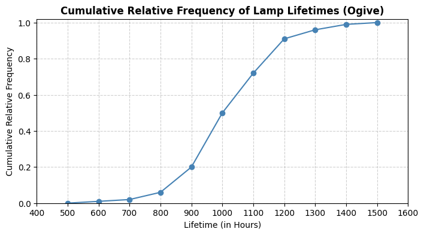
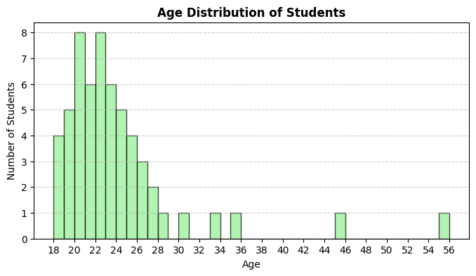
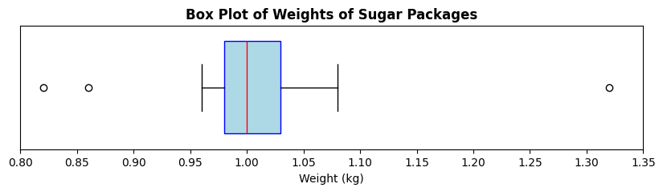

---
tags:
    - Descriptive Statistics 
    - Data Summaries
    - Visualization
    - Python
    - Pandas
    - Matplotlib  
    - Mean
    - Median
    - Mode
    - Range
    - Variance
    - Standard Deviation
    - Discrete Data
    - Continuous Data
    - Qualitative Data
    - Quantitative Data
    - Data Types 
---

<h1 align="center">Descriptive Statistics</h1>

### Session Preparation:

Brooks: [Chapter 6](https://docs.google.com/viewer?url=https://raw.githubusercontent.com/RBrooksDK/MSE_book_v2/master/main.pdf)

Some of the exercises may require you to use Python. You may also need to install the `pandas` and `matplotlib` libraries if you haven't already.

### Resources Danish Class:

[Session notes](https://drive.google.com/file/d/1wAMVD7qDRDlnW3YCHzxZjgo79k14Z6uz/view?usp=sharing)

[Session Resources](https://viaucdk-my.sharepoint.com/:f:/g/personal/rib_viauc_dk/EqVVdPEDkRFImG2F_pAn4C8BaNKeMesysbj3eFJqsKHllw?e=0fiXyu)

### Python Solution

[solutions06.ipynb](https://github.com/RBrooksDK/MSE1_25/blob/main/06/solutions06.ipynb)

### Exercises

#### Exercise 1: Mode Classification

Given the following datasets, classify each dataset as unimodal, multimodal, or no mode.

1. {1,2,3,4,5} (1) 
{ .annotate }

    1. No mode

2. {220,220,250,280,300,300,350} (1) 
{ .annotate }

    1. Multimodal (220, 300)

3. {High, High, Medium, Low, High, Medium, Low, Critical} (1)
{ .annotate }

    1. Unimodal (High)

#### Exercise 2: Categorize Data Types

Given the following information, categorize each as Qualitative or Quantitative data, and specify if Quantitative data is Discrete or Continuous.

1. Number of students in a class (1) 
{ .annotate }

    1. Quantitative, Discrete

2. Temperature in Celsius (1)
{ .annotate }

    1. Quantitative, Continuous

3. Types of fruits in a basket (1)
{ .annotate }

    1. Qualitative

4. Height of individuals in centimeters (1)
{ .annotate }

    1. Quantitative, Continuous

5. Colors of cars in a parking lot (1)
{ .annotate }

    1. Qualitative

#### Exercise 3: Calculate From a Diagram

Refer to the diagram above, which shows the cumulative relative frequency of lamp lifetimes (in hours). Use the diagram to answer the following questions:

1. What type of diagram is shown? (1)
{ .annotate }

    1. Ogive (Cumulative Relative Frequency Graph)

2. What is the median lifetime of the lamps? (1)
{ .annotate }

    1. Approximately 1000 hours

3. Estimate the first and third quartiles (Q1 and Q3) of the lamp lifetimes. (1)
{ .annotate }

    1. Q1 ≈ 900 hours, Q3 ≈ 1100 hours

4. What is the interquartile range (IQR) of the lamp lifetimes? (1)
{ .annotate }

    1. IQR ≈ 200 hours (Q3 - Q1)

5. Identify any potential outliers in the lamp lifetimes using the 1.5*IQR rule.

    ??? answer "&nbsp;"

        Values below 600 hours or above 1400 hours could be considered mild outliers. Values below 300 hours or above 1700 hours could be considered extreme outliers.

#### Exercise 4: Common Metrics (Python)

The following dataset represents the ages of 57 students in a class:

{18, 18, 18, 18, 19, 19, 19, 19, 19, 20, 20, 20, 20, 20, 20, 20, 20, 21, 21, 21, 21, 21, 21, 22, 22, 22, 22, 22, 22, 22, 22, 23, 23, 23, 23, 23, 23, 24, 24, 24, 24, 24, 25, 25, 25, 25, 26, 26, 26, 27, 27, 28, 30, 33, 35, 45, 55}

1. Make a frequency table for the data.

    ??? answer "&nbsp;"

        | Age | Frequency |
        |-----|-----------|
        | 18  | 4         |
        | 19  | 5         |
        | 20  | 8         |
        | 21  | 6         |
        | 22  | 8         |
        | 23  | 6         |
        | 24  | 5         |
        | 25  | 4         |
        | 26  | 3         |
        | 27  | 2         |
        | 28  | 1         |
        | 30  | 1         |
        | 33  | 1         |
        | 35  | 1         |
        | 45  | 1         |
        | 55  | 1         |

2. Plot a histogram of the data.

    ??? answer "&nbsp;"

        

3. How are the frequency table and histogram related?

    ??? answer "&nbsp;"

        The frequency table provides the numerical counts of each age, while the histogram visually represents these counts using bars. Each bar's height corresponds to the frequency of the respective age.

4. Compute the range of ages. (1)
{ .annotate }

    1. 37

5. Calculate the mean (1), median (2), sample variance (3), and sample standard deviation. (4)
{ .annotate }

    1. Mean: \(23.60\)
    2. Median: \(22\)
    3. Sample Variance: \(38.74\)
    4. Sample Standard Deviation: \(6.22\)

6. Find $P_{10}$ (1), $P_{90}$ (2), and the interquartile range (IQR). (3)
{ .annotate }

    1. \(P_{10} = 19\)
    2. \(P_{90} = 27.4\)
    3. $IQR = 5$

7. Identify mild and extreme outliers. (1)
{ .annotate }

    1. Mild outliers: 33, 35; Extreme outliers: 45, 55

8. Empirical Rule (normality check). Compare the proportions of students within 1, 2, and 3 standard deviations of the mean to the 68.3–95.4–99.7% rule.

    ??? answer "&nbsp;"

        - Within 1 standard deviation (17.37 to 29.82): 91.23%
        - Within 2 standard deviations (11.15 to 36.05): 96.49%
        - Within 3 standard deviations (4.92 to 42.27): 96.49%

        The data does not perfectly follow the Empirical Rule, indicating it may not be normally distributed.
    
9. Inspect the histogram for skewness. (1)
{ .annotate }

    1. The histogram shows a right (positive) skew, with a longer tail on the right side.

#### Exercise 5: Box Plot (Python)

A factory fills 1kg bags of sugar. The weights of a sample of 20 bags are recorded below (in kg):

{1.00, 1.01, 1.05, 0.99, 0.97, 1.01, 0.98, 0.99, 1.06, 1.06, 0.96, 1.00, 1.03, 0.97, 1.00, 0.99, 1.08, 1.01, 1.32, 0.82, 0.86}

The following box plot represents the distribution of the weights:

1. Identify the median weight from the box plot. (1)
{ .annotate }

    1. Median ≈ 1.00 kg

2. Estimate the first (Q1) and third (Q3) quartiles. (1)
{ .annotate }

    1. Q1 ≈ 0.98 kg, Q3 ≈ 1.03 kg

3. Calculate the interquartile range (IQR). (1)
{ .annotate }

    1. IQR ≈ 0.05 kg

4. Determine the range of weights. (1)
{ .annotate }

    1. Range ≈ 0.5 kg

5. Explain what the outliers represent in this context.

    ??? answer "&nbsp;"

        The outliers represent bags that are significantly underfilled or overfilled compared to the majority of bags.

6. What could the outliers indicate about the factory's filling process?

    ??? answer "&nbsp;"

        The outliers could indicate inconsistencies in the filling process, such as equipment malfunctions or human error. They do not suggest inaccuaracy of the scale, rather issues in the filling process itself.

7. Based on the box plot, discuss the symmetry or skewness of the weight distribution. (1)
{ .annotate }

    1. The box plot appears slightly right skewed.

8. Based on the determined skewness, discuss the values of mean, mode, and median. (1)
{ .annotate }

    1. In a right-skewed distribution, the mean is typically greater than the median, which is greater than the mode.

#### Exercise 6: Empirical Rule (Python)

For each dataset below, determine whether the data appear approximately normal, or not.

Use the Empirical Rule (68.3–95.4–99.7%) to justify your answer.

1. Response Times (ms) - Mean = 300, SD = 50, within 1 SD: 55%, within 2 SD: 78%, within 3 SD: 90% (1)
{ .annotate }

    1. Not Normal

2. Bug Reports per Week - Mean = 12, SD = 4, within 1 SD: 68%, within 2 SD: 94%, within 3 SD: 99% (1)
{ .annotate }

    1. Approximately Normal

3. Exam Scores: {55, 60, 62, 65, 68, 70, 72, 75, 78, 80, 82, 85, 88, 90, 92, 95} (1)
{ .annotate }

    1. Approximately Normal

4. Daily Step Counts (in thousands): {3, 4, 5, 6, 7, 8, 9, 10, 11, 12, 13, 14, 15} (1)
{ .annotate }

    1. Not Normal

### Challenge Exercises

#### Challenge 1: The “German Tank” Problem (Build Numbers)

A military intelligence unit intercepts serial numbers from enemy tanks. The numbers are sequential from 1 to an unknown maximum \(N\). In one skirmish they observe (unordered):
\(\{12, 38, 71, 5, 44, 73, 29, 55\}\).

Let \(n\) be the sample size and \(m\) the maximum observed number. Compute \(n\) and \(m\). (1)  
{ .annotate }

1. \(n=8,\ m=73\)

Two estimators for \(N\):  

MLE: \(\hat N_{\text{MLE}} = m\)  

Unbiased: \(\hat N_{\text{U}} = m\cdot\frac{n+1}{n}-1\)  

Compute both and give an integer estimate.

??? answer "&nbsp;"

    MLE: \(\hat N_{\text{MLE}} = 73\)

    Unbiased: \(\hat N_{\text{U}} = 73 \cdot \frac{9}{8} - 1 = 81.125 \approx 81\)

Suppose the unit later observes a new sample with \(n=10\) and \(m=79\). Without recomputing from scratch, explain which estimator you’d trust more for bias and why.  

??? answer "&nbsp;"

    The unbiased estimator reduces the systematic underestimation of \(N\) inherent in \(m\); prefer \(\hat N_{\text{U}}\) for lower bias.

Estimate the fraction of unseen tanks using your chosen \(\hat N\): \((\hat N - m)/\hat N\). Interpret it. 

??? answer "&nbsp;"

    Using \(\hat N_{\text{U}} = 81\): Fraction unseen = \((81 - 79)/81 \approx 0.0247\) or about 2.47%. This suggests that approximately 2.47% of the total tank production has not been observed in the sample.

Derive a one‐sided 95% upper bound for \(N\) from \( \mathbb{P}(M\le m)=(m/N)^n \) and compare to your point estimates.

??? answer "&nbsp;"

    Solving \( (m/N)^n = 0.95 \) for \(N\) gives \( N = m / (0.95^{1/n}) \). For \(m=79\) and \(n=10\), this yields \( N \approx 79 / (0.95^{0.1}) \approx 79.4 \). Thus, a one-sided 95% upper bound for \(N\) is approximately 80, which aligns closely with the unbiased estimate of 81.

Try to think about how descriptive statistics can help analysing other aspects of the data, e.g., what if the enemy is intentionally skipping numbers?

[3 min YT Video](https://www.youtube.com/watch?v=WLCwMRJBhuI)

#### Challenge 2: Simpson’s Paradox in Admissions

A university runs an admissions process for two departments. Each department admits students under **Program A** and **Program B**. Within each department, Program A has a higher admission rate than Program B, yet overall Program B has a higher admission rate.

Data:

| Department | Program | Admitted | Applicants |
|------------|---------|----------|------------|
| X          | A       | 10       | 50         |
| X          | B       | 171      | 950        |
| Y          | A       | 19       | 950        |
| Y          | B       | 1        | 50         |

1. Compute per-department admission rates for A and B. Decide the winner **within each department**.

    ??? answer "&nbsp;"

        Dept. X: A \(=10/50=20\%\), B \(=171/950=18\%\) → A wins  
        Dept. Y: A \(=19/950=2.0\%\), B \(=1/50=2.0\%\) → tie

2. Compute **overall** admission rates for A and B. Who wins overall?

    ??? answer "&nbsp;"

        A \(=(10+19)/(50+950)=29/1000=2.9\%\)  
        B \(=(171+1)/(950+50)=172/1000=17.2\%\) → **B wins overall**

3. Explain precisely why this does **not** contradict the results from before. Use weighted averages language.  

    ??? answer "&nbsp;"

        The overall rate is a weighted average of department-specific rates with **different weights**. A’s applicants are mostly in the tougher department, B’s in the easier one. This imbalance flips the aggregate outcome—**Simpson’s paradox**.

4. Give a statistically sound decision rule to avoid being misled here, and compute the appropriate aggregate under that rule. 

    ??? answer "&nbsp;"

        **Stratify** by department and compare programs within each stratum; then combine with **common weights** (e.g., equal mix) or use a regression with department as a covariate. If applicants were equally split across departments, Program A would be favored since A ≥ B in both strata.

[5 min YT video](https://www.youtube.com/watch?v=ebEkn-BiW5k)
