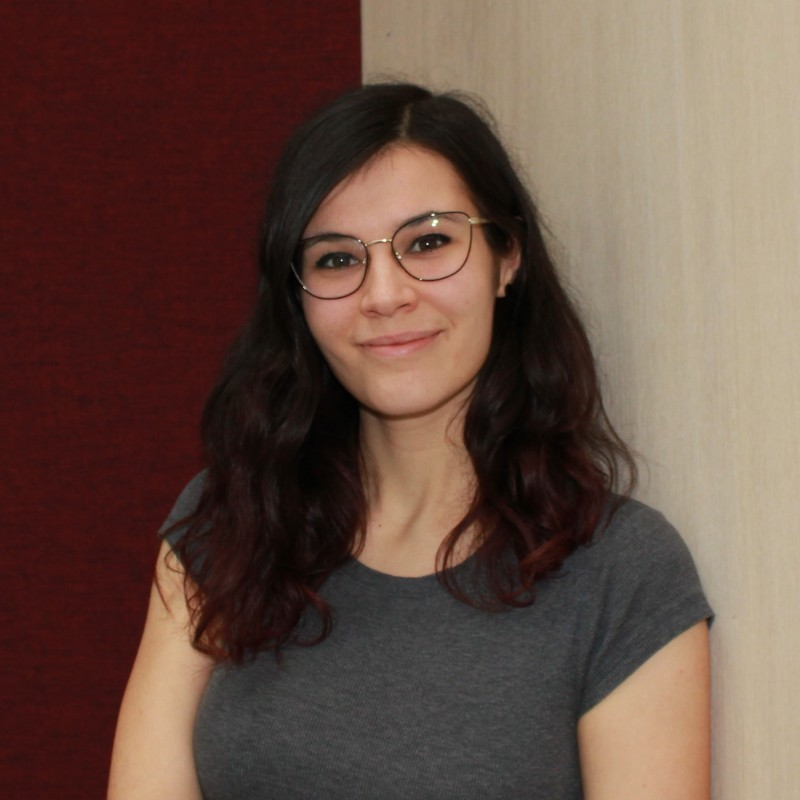

    <h1 align="center">Mathematics for Software Engineering - 2025</h1>
    
Course page for <a href="https://en.via.dk/tmh-courses/mathematics-for-software-engineering?education=ict">MSE1</a> at VIA

  <a href="https://rbrooksdk.github.io/MSE1_25">
    <video class="video-light custom-video" width="700" autoplay loop muted src="figures/introvid2.mp4"></video>
    <video class="video-dark custom-video" width="700" autoplay loop muted src="figures/introvid.mp4"></video>
  </a>

## <i class="fas fa-circle-info" style="color:#6CA2C6"></i> Course Information

This course provides a basic introduction to the areas of mathematics most relevant to software engineers.

* **Course Responsible:** [Richard Brooks](https://rbrooksdk.github.io), <rib@via.dk>
* **Credits:** 5 ECTS (European Credit Transfer System), equivalent to 130 working hours
* **Level:** Bachelor
* **Assessment:** 4-hour written exam with physical attendance, graded according to the 7-point scale (see exam description in the menu)

## <i class="fas fa-solid fa-list-check" style="color:#6CA2C6"></i> Prerequisites

Mathematics equivalent to high school A-level is assumed. If it has been several years since you last worked with mathematics, we recommend participating in our screening program. Typically, the basic topics cause the most problems, so you should ensure you have a solid understanding of these.

## <i class="fas fa-vector-square" style="color:#6CA2C6"></i> Teaching and Course Structure

The course starts in week 36 and ends 13 weeks later, with no classes in week 42. A session is defined as consisting of two activities:

1. **Lecture**: A 2 x 45 minute lecture held by the instructor.
2. **Tutorial** 4 x 45 minutes working on and going through exercises with the teaching assistant (TA).

There are no mandatory submissions, though there will be other mandatory course activities.

## <i class="fas fa-users" style="color:#6CA2C6"></i> About Us

- 

    **Richard Brooks**  
    Associate Professor  

    Teaches: DK  
    Contact: [:material-email:](mailto:rib@via.dk)

- 

    **Markéta Tranberg**  
    Part-Time Lecturer

    Teaches: X, Y, and DK 
    Contact: [:material-email:](mailto:mlap@via.dk)

- 

    **Eduard Fekete**  
    TA

    Teaches: X     
    Contact: [:material-email:](mailto:355323@via.dk)

- 

    **Carolina Zavidei**  
    TA

    Teaches: Y   
    Contact: [:material-email:](mailto:354825@via.dk)

## <i class="fas fa-wave-square" style="color:#6CA2C6"></i> Course Content and Learning Objectives

The course focuses on the application of mathematical concepts and methods in software development and computer science:

- **Arithmetic**: Basic arithmetic operations and their applications.
- **Functions**: Understanding functions, including domain, range, and graphical representation.
- **Set Theory**: Introduction to sets, including union, intersection, complement, and De Morgan's laws.
- **Combinatorics:** Basic principles of counting, including permutations and combinations.
- **Probability**: Basic probability theory, including conditional probability and independence.
- **Statistics**: Introduction to statistical concepts, including mean, median, variance, and standard deviation.
- **Linear Algebra**: Basic concepts in linear algebra, including vectors, matrices, and determinant calculation.
- **Differential Calculus**: Basic concepts in differential calculus, including limits, continuity, differentiability, gradient, and slope.

## <i class="fas fa-book-open" style="color:#6CA2C6"></i> Materials

**Textbook:** The course is based on the book "Mathematics for Software Engineering" by Richard Brooks. The book is available as an e-book and can be found in the Resources tab.

**Exercises:** Available for each session and can be found under "Sessions" above.

**Other Online Resources:** We have linked to several online materials, which can be found in the Resources tab above. These are not mandatory.

**Course Software:** Ensure you have a working version of Jupyter Notebook and Python version 3.7 or newer installed. You are free to choose which IDE to work in, as long as it supports Jupyter Notebooks. Installing VS Code with the Jupyter Notebook extension is a popular choice. You may also find it helpful to have a calculator for the exam.

---

The Wiseflow code for all flows used during the course is always 0000. However, this is not the code for the exam in January.

---

## <i class="fa fa-history" style="color:#6CA2C6"></i> Historical Notes

Mathematics for Software Engineering was first offered in 2017 and is taught once a year. The course responsible is [Richard Brooks (RIB)](https://rbrooksdk.github.io).

  <h3 align="center">Grade Distribution 2024 (only regular exam)</h3>
    <table>
      <thead>
        <tr>
          <th style="text-align:center;">Grade</th>
          <th style="text-align:center;">Count</th>
        </tr>
      </thead>
      <tbody>
        <tr><td style="text-align:center;">12</td><td style="text-align:center;">10</td></tr>
        <tr><td style="text-align:center;">10</td><td style="text-align:center;">13</td></tr>
        <tr><td style="text-align:center;">7</td><td style="text-align:center;">25</td></tr>
        <tr><td style="text-align:center;">4</td><td style="text-align:center;">15</td></tr>
        <tr><td style="text-align:center;">02</td><td style="text-align:center;">12</td></tr>
        <tr><td style="text-align:center;">00</td><td style="text-align:center;">18</td></tr>
        <tr><td style="text-align:center;">-3</td><td style="text-align:center;">1</td></tr>
      </tbody>
    </table>

